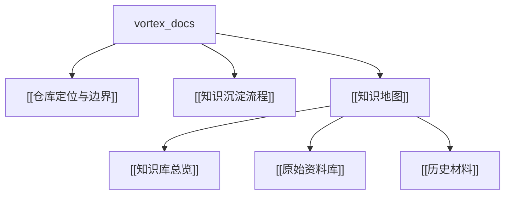

# 知识库结构总览

这个目录回答：`vortex_docs` 作为独立知识系统，应该如何定位、沉淀和导航。

## 结构图

```mermaid
flowchart TD
  A["vortex_docs"] --> B["[[仓库定位与边界]]"]
  A --> C["[[知识沉淀流程]]"]
  A --> D["[[知识地图]]"]
  D --> F["[[知识库总览]]"]
  D --> G["[[原始资料库]]"]
  D --> H["[[历史材料]]"]
```

## 快速入口

- [[仓库定位与边界]]
- [[知识沉淀流程]]
- [[知识地图]]

## 相关内容地图

- [[知识库总览]]
- [[原始资料库]]
- [[历史材料]]
