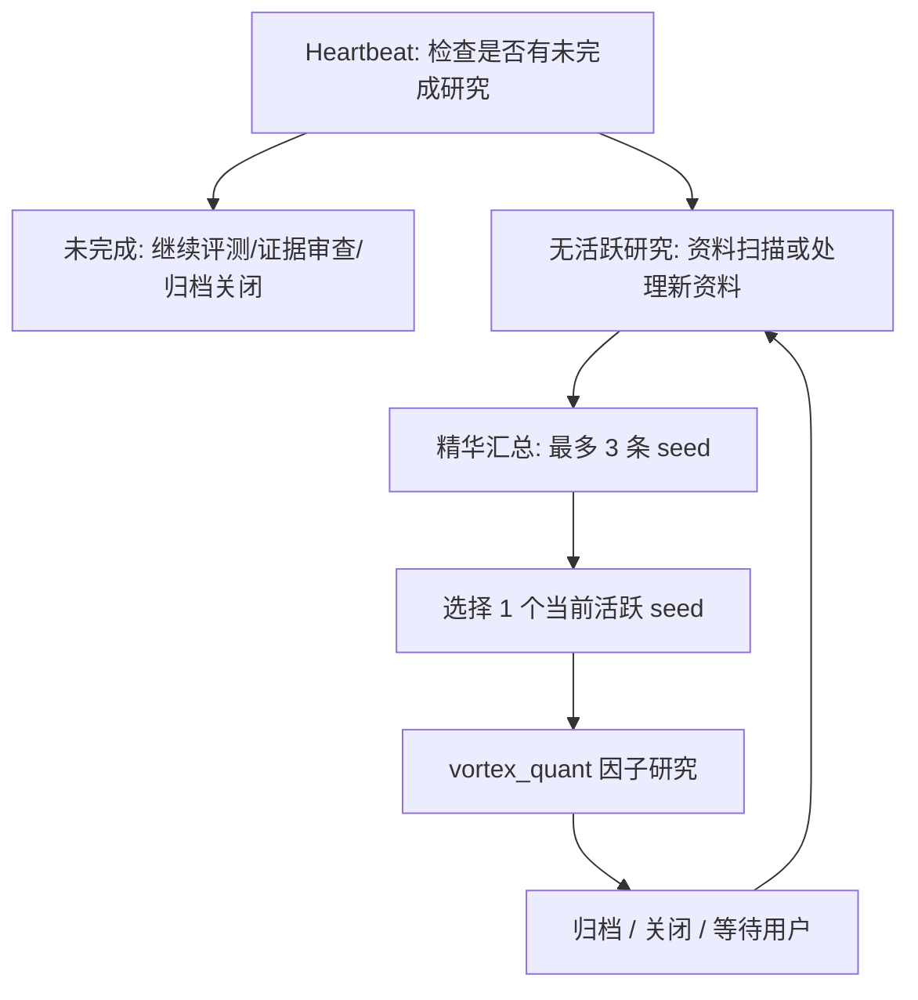

# Codex 自动化落地方案

关联：[[AI模型知识]]、[[低成本AI Agent研究架构]]、[[量化研究自动化任务设计]]

## 一句话结论

现阶段不引入其他 agent 框架。把 Codex 当作唯一 agent 平台，使用三类能力：

1. **交互线程**：负责判断、取舍、提问、审阅和最终决策。
2. **cron 自动化**：负责固定频率、低风险、可重复的资料巡检和知识沉淀。
3. **heartbeat 接力**：负责同一线程里的短周期长跑任务，但必须有状态卡和唯一下一步目标。

Codex UI 是总控台：看状态、看 diff、看产物、发起新任务、暂停或恢复自动化。

飞书是提醒通道：有实质进展、阶段性结论、阻塞或需要用户决策时推送短消息；没有新动作价值的普通心跳不推送。状态事实仍以状态卡、handoff、研究总表和 artifact 为准。自动化只是通知功能的使用方，必须走 `vortex_quant` 的后台通知服务/通知路由，不直接执行飞书脚本或绕过通知审计。

知识沉淀不是把 inbox 全量搬进 `knowledge/`。自动化应在资料精选阶段判断 `archive_action`：值得长期保留的资料写成短来源卡、阅读笔记或可行性备忘录；噪声、重复或证据不足的资料只留在巡检文件里。

当前更正：为了让上下文维持在同一个 session，资料扫描、精华汇总、因子研究和归档关闭不再拆成两个 cron。它们合并进一个 rolling heartbeat：`Vortex 滚动资料到因子研究闭环`。自然周只作为日志标签，不再限制一周只能做一轮；只要没有活跃因子研究，且新资料能形成合格 seed，就允许进入下一轮。

## 当前可用资产

本机当前已有三条 automation：

| 名称 | 类型 | 状态 | 工作区 | 角色 |
|---|---|---|---|---|
| `量化资料周度巡检` | cron | PAUSED | `../vortex_docs` | 已暂停；功能并入同一 heartbeat |
| `量化资料精选与因子线索交接` | cron | PAUSED | `../vortex_docs` | 已暂停；功能并入同一 heartbeat |
| `Vortex 滚动资料到因子研究闭环` | heartbeat | ACTIVE | `vortex_docs` + `vortex_quant` + `vortex_workspace` | 每 2 小时醒来检查；同一线程内完成资料搜索、精华汇总、seed 选择、因子研究、归档或关闭；不按自然周限流 |

已有设计文档：

- [[量化研究自动化任务设计]]
- [[量化研究候选议题池]]
- [[低成本AI Agent研究架构]]

## 分工原则

### 交互线程：高判断密度

适用：

- 用户想清楚问题边界。
- 决定研究方向。
- 审查自动化产物质量。
- 从候选议题里选下一步。
- 需要跨仓库、跨文件、跨背景做判断。
- 需要修改自动化 prompt、状态卡或工作流。

不适用：

- 固定低风险资料巡检。
- 固定格式归档。
- 没有明确目标的大范围搜索。

交互线程每次结束应留下：

- 当前判断。
- 下一步唯一动作。
- 是否需要创建、暂停、修改 automation。
- 是否需要写入 Obsidian 或 handoff。

### cron 自动化：低风险重复劳动

适用：

- 资料巡检。
- 证据提炼。
- 候选议题池维护。
- 学习周报。
- 文档断链校验。

不适用：

- 会修改生产策略或交易配置的任务。
- 需要用户实时取舍的任务。
- 没有稳定输入/输出格式的探索性任务。
- 会产生大量噪声文档的任务。

cron 自动化必须有：

- 固定工作区。
- 固定输入文件或目录。
- 固定输出路径。
- 清楚的“不做什么”边界。
- 产物数量上限。
- 结束时的验证命令或自检说明。

### heartbeat 接力：同一目标的短周期推进

适用：

- 一个研究任务已经有状态卡。
- 下一步目标唯一。
- 需要 30-90 分钟后继续同一上下文。
- 需要多轮接力，但不能跑偏。

不适用：

- 泛泛“继续研究”。
- 同时推进多个方向。
- 没有状态卡、scorecard 或关闭条件。
- 可能触碰实盘、交易、凭证、broker、QMT 的任务。

heartbeat 的硬要求：

- 每轮先读状态卡。
- 每轮写回本轮产物、证据、命令和下一轮唯一目标。
- 如果状态不一致，先修状态，不继续推进研究。
- 有实质进展、阶段性结论、阻塞或需要用户决策时，通过后台通知服务发送飞书短提醒；没有新证据或新决策时不打扰。
- 不能自动提交 git。
- 不能把研究结论直接推进实盘路径。

## 滚动运行节奏



建议节奏：

1. Heartbeat 每次醒来先检查 `factor_research_state.md` 是否有未完成研究。
2. 有未完成研究时，先推进到归档或关闭，不开新题。
3. 没有活跃研究时，先读取 [[量化因子研究入口地图]] 作为资料来源总表，再搜索外部资料或处理用户标记的新资料，并写入 `inbox/quant-research/`。
4. 从本轮资料里最多汇总 3 条精华 seed，并为每条给出 `archive_action`。
5. 值得长期保留的文章或论文要沉淀到 `knowledge/`：来源卡、阅读笔记、可行性备忘录或 skill 候选；不值得保留的标 `no_archive`。
6. 同一时间只选择 1 条进入因子研究；当前 seed 归档或关闭后，可在同一自然周继续下一条。
7. 研究不能停在 `promising`；必须继续到 full eval、risk review、archive、close 或等待用户 seed。
8. Heartbeat 可以每 2 小时醒来一次，但状态卡只按来源、digest artifact 和活跃 seed 去重；自然周不再阻断新一轮。

## 任务模板

### 人工交互启动语

```text
请按 Codex-only Agent 工作法，审查本周 vortex_docs 自动化产物：
1. 读取 inbox/quant-research/ 最近巡检笔记。
2. 读取 knowledge/research-methods/量化研究候选议题池.md。
3. 选出最多 3 个值得我亲自读的方向。
4. 说明机制、证据、A 股迁移问题、点时风险和下一步。
5. 不写策略、回测、交易或 vortex_quant 代码。
```

### cron 自动化 prompt 约束

```text
只做低风险资料巡检和知识沉淀。
必须写入固定路径。
每轮最多选择 N 条。
必须保留来源链接、日期、机构或作者。
必须记录证据强弱和暂缓原因。
不修改 vortex_quant。
不写策略、回测、交易或数据拉取代码。
结束后运行 Obsidian wikilink 校验。
```

### heartbeat prompt 约束

```text
本轮只有一个目标。
先读状态卡和最新 handoff。
如果状态冲突，先修状态，不推进研究。
必须写 scorecard delta、证据路径、复现命令和下一轮唯一目标。
禁止交易、QMT、broker、凭证、preset、paper/live 路径。
禁止自动提交 git。
```

## 决策规则

### 什么时候创建 automation

满足全部条件才创建：

- 任务会重复发生。
- 输入和输出路径稳定。
- 失败不会造成生产风险。
- 可以用一句话说明“完成”的定义。
- 可以限制产物数量。
- 可以接受自动化只做初筛，最终由交互线程审查。

### 什么时候不要创建 automation

任一条件成立就不要创建：

- 问题还没想清楚。
- 输出标准不稳定。
- 需要实时取舍。
- 会碰交易、凭证、实盘配置或生产 preset。
- 只是在逃避人工判断。

### 什么时候暂停 automation

- 连续两轮产物没有新增判断价值。
- 产物越来越多但候选池没有升级、降级或暂缓决策。
- 自动化开始重复搬运同类材料。
- prompt 与当前研究目标冲突。
- 状态卡、handoff、候选池不一致。

## 产物验收

每个自动化产物至少要能回答：

- 本轮读了什么输入。
- 新增了什么判断。
- 哪些内容被暂缓，为什么。
- 哪些内容进入候选池。
- 哪些内容值得用户亲自读。
- 下一步唯一动作是什么。

如果回答不了这些问题，就不是有效自动化，只是文档生成。

## 当前落地动作

1. 暂停两个独立 cron，避免每轮创建新上下文。
2. 将 `Vortex 因子研究长跑接力` 改成 `Vortex 滚动资料到因子研究闭环` heartbeat，并把醒来间隔调整为每 2 小时。
3. 继续使用兼容旧入口的状态卡：`../vortex_workspace/research/automation/weekly_research_cycle_state.md`；文件名保留，但运行规则已改为 rolling multi-round。
4. Heartbeat 当前已选择 `slope_strength_retail_extrapolation` 作为滚动活跃 seed；下一步从 archive lookup 开始，不直接写 runner 或跑 IC。
5. 暂不引入外部 agent 框架。
