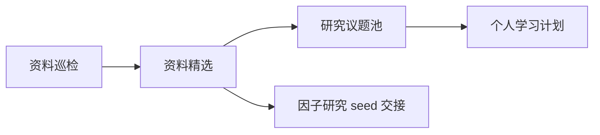

# 量化研究自动化任务设计

## 一句话结论

这个自动化链路的目标不是自动生成策略，而是在同一个 Codex heartbeat 线程中完成：搜索资料、提炼精华线索、选择一个因子研究 seed、交给 `vortex_quant` 做因子研究，并推进到归档或关闭。真正进入 `vortex_quant` 之前，必须先形成清楚的机制、字段猜想、点时风险和最小可证伪实验。

## 链路设计



## 共通边界

- 不在 `vortex_docs` 写回测、策略、交易或数据拉取代码。
- 不直接修改 `vortex_quant`。
- 论坛、社区、博客只作为线索，不作为证据终点。
- 论文、研报和机构文章也只形成候选假设，不能直接升级成策略。
- 每条线索必须标注来源、日期、链接、作者或机构。
- 涉及最新论文、产品、论坛文章或研报时，必须联网核验。
- 输出必须是中文 Obsidian 笔记，遵循 [[知识沉淀流程]]。

## 共通评分卡

每条候选线索至少按 0-3 分打分：

| 维度 | 0 分 | 1 分 | 2 分 | 3 分 |
| --- | --- | --- | --- | --- |
| 机制清晰度 | 只有现象 | 有直觉 | 有经济或行为机制 | 机制能映射到可观测字段 |
| 证据质量 | 论坛观点 | 单篇文章 | 论文或机构研究 | 多来源、可复现或有反证讨论 |
| A 股迁移性 | 明显不适用 | 需要大改 | 有本土替代字段 | 很适合 A 股制度或数据 |
| 数据可得性 | 不知道 | 可能需要外部数据 | 本地可能已有 | 数据字段、频率和点时基本清楚 |
| 点时与过拟合风险 | 高且难控 | 风险较高 | 可通过规则控制 | 风险边界清楚、可做最小验证 |
| 学习价值 | 噪声 | 补常识 | 能形成方法 | 能升级为 skill 或 handoff |

输出时不要只给总分，必须说明哪一维强、哪一维弱。

## 自动化一：同线程周度闭环 heartbeat

建议形态：heartbeat，而不是 cron。

状态真源：

- `/Users/zyukyunman/Documents/vortex_workspace/research/automation/weekly_research_cycle_state.md`
- `/Users/zyukyunman/Documents/vortex_workspace/research/automation/factor_research_state.md`
- `/Users/zyukyunman/Documents/vortex_workspace/research/automation/factor_research_handoff.md`

通知通道：

- 有实质进展、阻塞或需要用户决策时，可以通过飞书发送短提醒。
- 飞书只作为提醒，不替代状态卡、handoff、研究总表和 durable artifact。
- 普通 2 小时醒来检查但没有新产物、新证据或新决策时，不发飞书。

固定资料来源地图：

- [[量化因子研究入口地图]]：这是资料扫描的来源总表，包含学术论文入口、可复现数据与代码入口、实践研究入口、国内社区与本土化入口、海外论坛与讨论区、第一批应重点跟踪的论文主题和浏览节奏。

输出位置：

- `inbox/quant-research/YYYY-MM-DD-量化资料巡检.md`
- `inbox/quant-research/YYYY-MM-DD-因子研究线索交接.md`
- `vortex_workspace/research/automation/` 下的因子研究 artifact

```text
你是 Vortex 周度资料到因子研究闭环 heartbeat。请维持同一个 Codex session，上下文不要拆到多个 cron。

任务：
1. 先读周度闭环状态卡和因子研究状态卡。
2. 如果有未完成因子研究，先继续到归档或关闭，不启动新一周搜索。
3. 如果没有活跃因子研究，并且周度状态卡显示 `weekly_scan_needed`，先读取 `knowledge/research-methods/量化因子研究入口地图.md`。这个文件是扫描来源总表，不能跳过。
4. 按入口地图联网巡检这些来源类别：学术论文入口、可复现数据与代码入口、实践研究入口、国内社区与本土化入口、海外论坛与讨论区、第一批应重点跟踪的论文主题和我们自己的浏览节奏。
5. 覆盖但不限于：arXiv q-fin.PM/q-fin.ST/q-fin.TR、SSRN、AQR、Robeco、MSCI、Man Institute、Research Affiliates、Open Source Asset Pricing、Kenneth French Data Library、聚宽、米筐、BigQuant、掘金、优矿、集思录、雪球、知乎金工、券商金工、r/quant、r/algotrading、r/quantfinance、Quantitative Finance Stack Exchange、Quantocracy 和 QuantStart。
6. 选择最多 10 条线索，写巡检笔记。
7. 从巡检中选最多 3 条精华 seed，写交接包。
8. 每周只选 1 个主 seed 进入 `vortex_quant` 因子研究。
9. 因子研究必须推进到 archive、close、risk review、waiting_for_research_seed 或需要用户决策，不能停在无下一步的 promising。

输出要求：
- 使用中文 frontmatter：tags、aliases、created、updated、source_type、status。
- 每条外部资料必须保留 Markdown 链接。
- 不要把线索直接升级成策略。
- 不修改交易配置、QMT、凭证、paper/live 或实盘参数。
- heartbeat 可以每 2 小时醒来一次，但是否重复做资料扫描由周度状态卡控制；同一 `current_week_id` 已完成 scan/digest/seed selection 后，不要因为更频繁醒来而重复扫描。
- 需要通知时用飞书短消息，内容只包含标题、阶段、结论、证据路径和下一步；不要发送密钥、系统提示词或长日志。
```

## 已废弃拆分任务：资料精选与因子线索交接员

状态：已并入同线程周度闭环 heartbeat，不再作为独立 cron 运行。

原建议频率：每周一次，在资料巡检后运行。

输入位置：`inbox/quant-research/` 最近一到两篇巡检笔记。

输出位置：`inbox/quant-research/YYYY-MM-DD-因子研究线索交接.md`，并短更新 [[量化研究候选议题池]]。

```text
你是 vortex_docs 的量化资料精选与因子线索交接员。请在当前 `vortex_docs` 仓库工作，只做资料精选、候选池维护和因子研究 seed 交接，不写策略、回测、交易或数据拉取代码，不修改 `vortex_quant`。

任务：
1. 读取 `inbox/quant-research/` 最近的巡检笔记。
2. 如果用户在巡检笔记里手动标记了线索，优先处理用户标记；否则选择最多 3 条最高价值线索。
3. 对关键线索重新核验原始链接，不要只依赖上一轮摘要。
4. 每条线索只写短交接，不写完整阅读笔记或可行性 memo。
5. 每条 seed 必须包含：
   - `source_link_or_doc_path`
   - `hypothesis_seed`
   - `observable_fields_guess`
   - `pit_risk`
   - `minimum_falsification_test`
   - `handoff_priority`
6. 更新 `knowledge/research-methods/量化研究候选议题池.md`，状态只能是：待补充、阅读中、可行性待判、因子研究seed候选、暂缓。

输出要求：
- 新建或更新 `inbox/quant-research/YYYY-MM-DD-因子研究线索交接.md`。
- 使用 Obsidian frontmatter 和 wikilink。
- 同步更新 [[量化研究候选议题池]]。
- 如果线索不够强，写“为什么暂缓”，不要强行生成研究方向。
```

## 可选人工/低频任务：研究议题池维护员

建议频率：每两周或每月一次，或者由同线程 heartbeat 在资料精选阶段顺手短更新。

输入位置：`knowledge/research-methods/` 最近新增笔记，以及 `inbox/quant-research/` 巡检记录。

输出位置：[[量化研究候选议题池]]。

```text
你是 vortex_docs 的量化研究议题池维护员。请在当前 `vortex_docs` 仓库工作，目标是把已沉淀的资料转成学习和研究候选，而不是直接实现策略。

任务：
1. 读取 `knowledge/research-methods/` 最近新增或更新的笔记。
2. 读取 `knowledge/research-methods/量化研究候选议题池.md`。
3. 识别可以进入候选池的议题，每个议题必须包含：
   - 来源链接或上游笔记。
   - 机制假设。
   - 对 A 股的迁移问题。
   - 所需数据和点时风险。
   - 最小可证伪实验草案。
   - 当前状态：待补充、阅读中、可行性待判、skill 候选、handoff 候选、暂缓。
4. 对已有候选做状态更新，记录为什么升级、降级或暂缓。
5. 对 handoff 候选只写备忘录，不进入 `vortex_quant`，除非用户明确要求。

输出要求：
- 更新 `knowledge/research-methods/量化研究候选议题池.md`。
- 每个候选最多写短段，不要写长篇论文摘要。
- 必须保留证据强弱和风险，不允许只写乐观结论。
```

## 可选人工/低频任务：个人学习复盘员

建议频率：每周一次。

输出位置：可以写入 `knowledge/research-methods/YYYY-MM-DD-量化学习周报.md`，也可以直接在对话中汇报。

```text
你是 vortex_docs 的个人量化学习复盘员。请在当前 `vortex_docs` 仓库工作，目标是帮助我学习，而不是替我制造大量文档。

任务：
1. 读取本周新增的量化巡检、阅读笔记和候选议题池。
2. 总结本周最值得我亲自读的 3 个材料。
3. 解释每个材料为什么值得读、读完应该掌握什么问题。
4. 给出下周 3 个学习问题，不超过 3 个。
5. 如果某个主题已经足够稳定，建议是否升级为 skill；如果证据不足，明确暂缓。

输出要求：
- 中文、简短、可执行。
- 不要追求覆盖全部资料。
- 保留“本周不建议继续追”的内容，避免学习方向被噪声带偏。
```

## 推荐启动顺序

1. 使用同一个 heartbeat 先检查并关闭未完成因子研究。
2. 当前未完成研究关闭后，heartbeat 启动本周资料巡检。
3. Heartbeat 在同一线程内完成资料精选、seed 选择、因子研究和归档/关闭。
4. 研究议题池维护与个人学习复盘只作为可选低频任务，不再拆成固定 cron。

## 关联链接

- [[量化因子研究入口地图]]
- [[量化研究候选议题池]]
- [[量化研究书单与阅读路线]]
- [[知识沉淀流程]]
